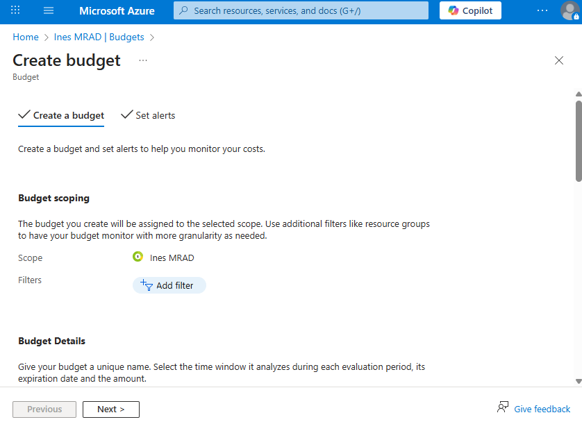
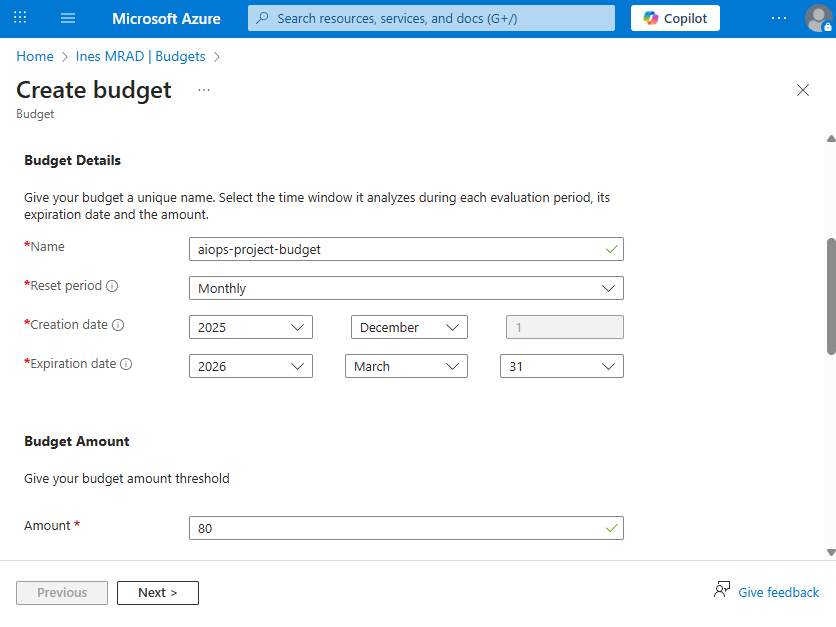
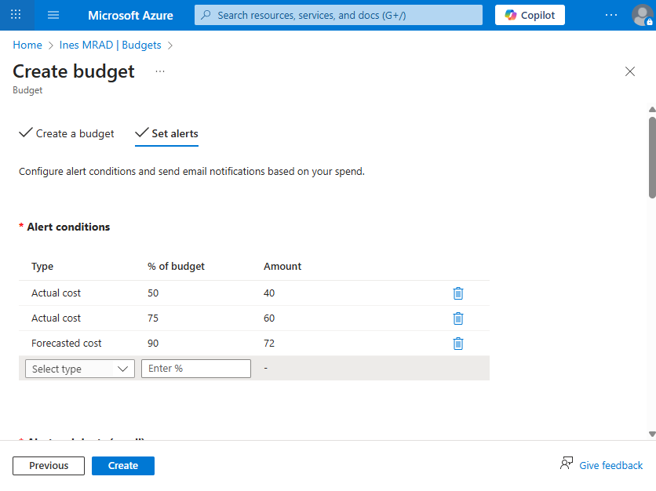
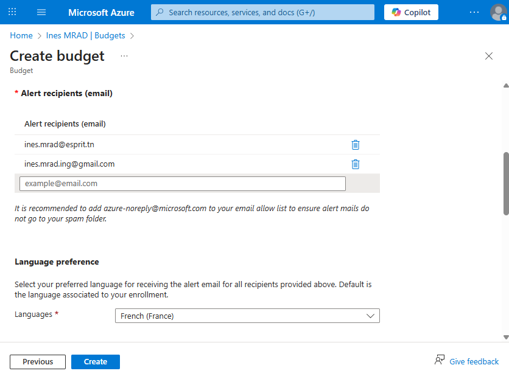
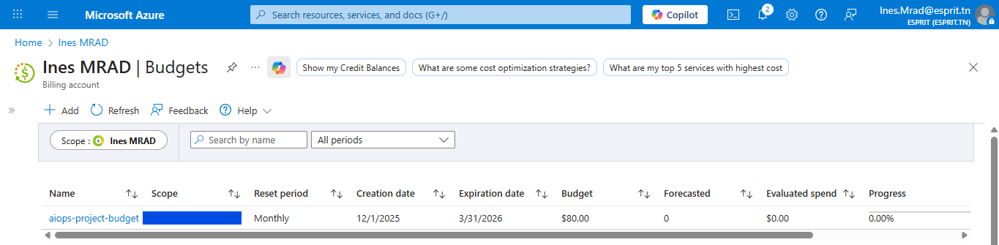
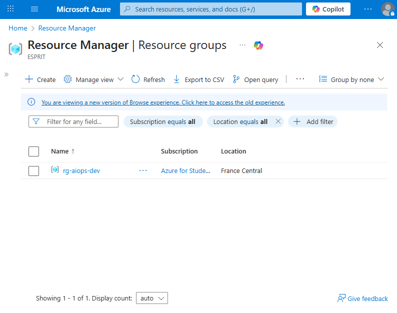
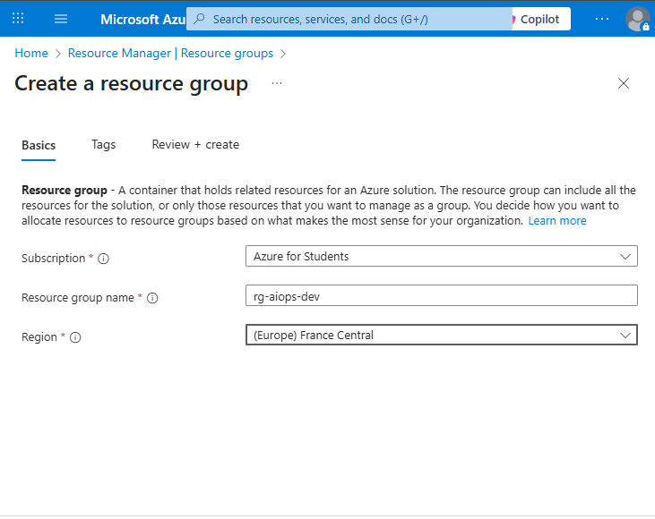
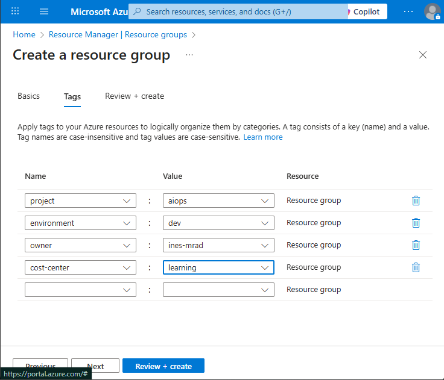
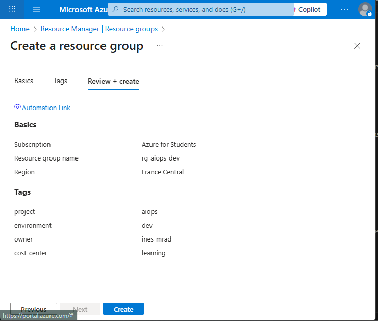

# Day 1 – Azure Foundation & Cost Governance

## Date
14/12/2025

## Objective
Establish a secure, cost-controlled Azure foundation to ensure safe, manageable development and prevent overspending.

---

## Actions Performed

### 1. Azure Budget Configuration
**Purpose:**  
Prevent unexpected cloud costs and enforce budget discipline.

**Steps:**
1. Navigated to **Azure Portal → Cost Management + Billing**
2. Created a **monthly budget** named `aiops-project-budget`
3. Set **budget limit**: $80
4. Configured **alert thresholds** at 50%, 75%, and 90%
5. Enabled **email notifications** for alerts

**Result:**  
Automated cost monitoring is now active at the subscription level.

**Evidence / Screenshots:**  
  
  
  
  

---

### 2. Resource Group Creation
**Purpose:**  
Provide logical isolation for all project resources to simplify management, enable cost tracking, and allow safe teardown of the environment.

**Configuration:**
- **Resource Group Name:** `rg-aiops-dev`  
- **Region:** France Central  
- **Tags:**  
  - project: aiops  
  - environment: dev  
  - owner: ines-mrad  
  - cost-center: learning  
  - terraform-managed: true (for IaC traceability)  

**Result:**  
A dedicated, well-tagged resource group is ready to host all project resources.

**Evidence / Screenshot:**  
  
  
  

---

### 3. Identity & Access Management
**Purpose:**  
Enable secure automation using Terraform while minimizing exposure of personal credentials.

**Actions:**
- **Service Principal limitation identified:** Student accounts cannot create Service Principals
- **Implemented secure workaround:** Using Azure CLI authentication
- **Security measures applied:** 
  - Credentials stored locally (not in version control)
  - `.gitignore` configured to exclude sensitive files
  - Workaround documented for future production migration

**Result:**  
Secure authentication established without exposing credentials in version control.  
Workaround documented for future migration to Service Principal in production environments.

**Evidence:**  
*Authentication method validated through Terraform successful initialization and plan execution.*

---

## Security Considerations Applied
- Principle of **least privilege**
- Separation of **personal and automation identities**
- Cost governance enforced via **budget alerts**

---

## Cost Status
- **Current spend:** $0.00  
- **Budget alerts:** active at 50%, 75%, and 90% thresholds

---

## Lessons Learned
- Azure governance must be **established before infrastructure deployment**
- Budget alerts **significantly reduce financial risk**
- Student accounts have **limitations on creating Service Principals**; document workarounds

---

## Next Step
**Day 2:** Infrastructure provisioning using Terraform:
- Create VNet, Subnets, and Network Security Groups  
- Deploy Log Analytics workspace  
- Set up basic monitoring and alert rules