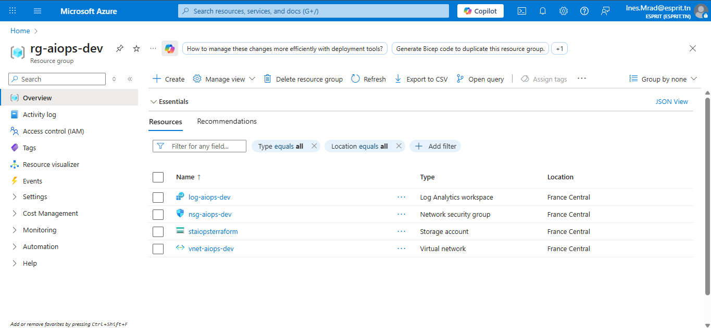
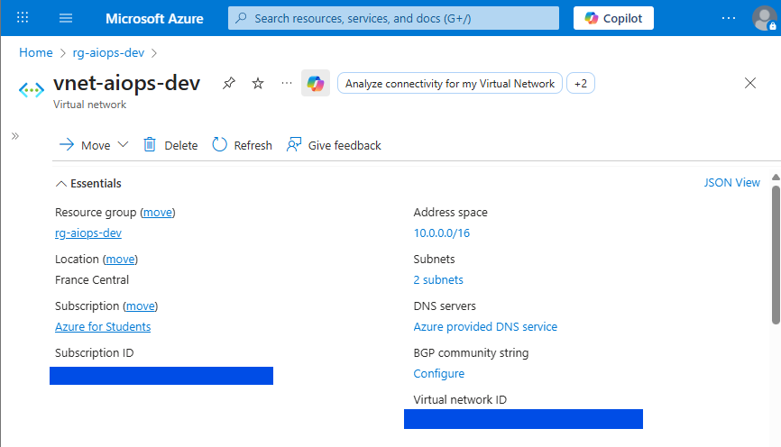
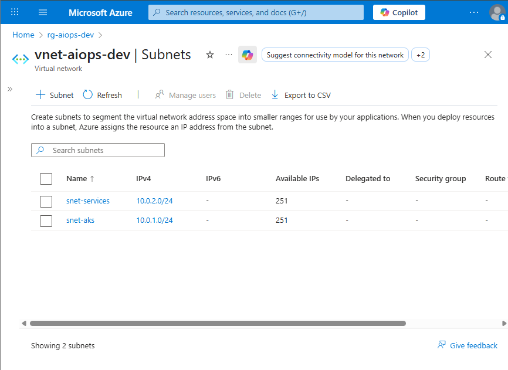
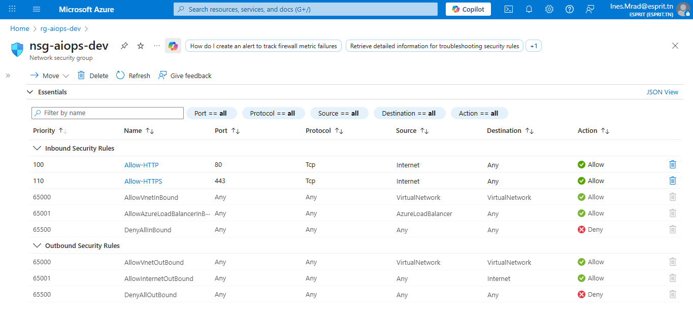
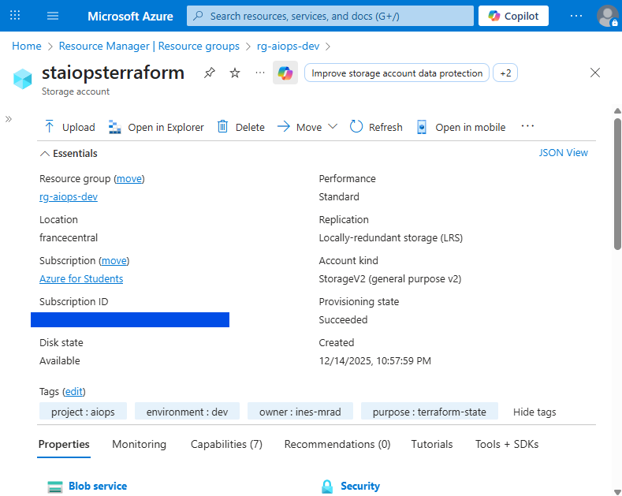

# Day 2: Secure Infrastructure Foundation

## Date
December 15, 2025

## Objective
Deploy secure networking foundation and observability for AIOps platform.

## Resources Deployed
1. **Virtual Network**: `vnet-aiops-dev` (10.0.0.0/16)
2. **Subnets**: 
   - AKS: `snet-aks` (10.0.1.0/24)
   - Services: `snet-services` (10.0.2.0/24)
3. **Network Security Group**: `nsg-aiops-dev`
   - Allow HTTP (port 80)
   - Allow HTTPS (port 443)
4. **Log Analytics Workspace**: `log-aiops-dev`
   - 30-day retention
   - PerGB2018 pricing tier
5. **Terraform State**: Migrated to Azure Storage

## Security Considerations
- Minimal inbound rules (HTTP/HTTPS only)
- No SSH access configured (security by default)
- Log Analytics for audit trail
- Storage account with TLS 1.2 and encryption

## Cost Analysis
- Estimated daily: $1.56
- Monthly projection: ~$47
- Well within $80 budget

## Screenshots

### Resource Group Overview


### Virtual Network and Subnets



### Network Security Rules


### Log Analytics Workspace


### Terraform State Configuration


# Day 3: AKS & Core Services Deployment

## Date
December 15, 2025

## Objective
Deploy a production-ready AKS cluster with network integration, monitoring, and security for the AIOps Cloud Native Platform.

## Status
✅ COMPLETE - AKS cluster operational

## Achieved Objectives
- ✅ AKS Cluster deployed on Azure
- ✅ Azure Container Registry (ACR) created and connected
- ✅ Monitoring enabled via Log Analytics Workspace
- ✅ RBAC and security enabled
- ✅ Network connectivity with existing VNet
- ✅ kubectl access configured and validated

## Deployed Architecture
Resources created:
- **AKS Cluster**: `aks-aiops-dev`
  - Node Pool: system (1 node Standard_B2s)
  - Network: Azure CNI + Calico
  - Monitoring: Log Analytics integrated
- **ACR**: `acraioopsdev395`
  - SKU: Basic (cost-effective)
- **RBAC**: AcrPull role assigned

## Detailed Execution Log

### Phase 1: Preparation and Validation
```bash
terraform init
# Initializing the backend...
# Successfully configured the backend "azurerm"!

terraform validate
# Success! The configuration is valid.
```

### Phase 2: Terraform Deployment
Execution plan validated:
- Plan: 2 to add, 0 to change, 0 to destroy.
- Resources to create: azurerm_kubernetes_cluster.main, azurerm_role_assignment.aks_acr_pull

```bash
terraform apply
# azurerm_kubernetes_cluster.main: Creating...
# azurerm_kubernetes_cluster.main: Creation complete after 5m21s
# azurerm_role_assignment.aks_acr_pull: Creation complete after 30s
# Apply complete! Resources: 2 added, 0 changed, 0 to destroy.
```

**Warnings Noted:**
- Warning: Argument `docker_bridge_cidr` is deprecated and will be removed in version 4.0 of the AzureRM provider.
- Action: Monitor during provider updates.

### Phase 3: Kubernetes Access Configuration
Generate kubeconfig:
```bash
terraform output -raw kubeconfig_raw > kubeconfig.yaml
```

Set environment variable:
```bash
$env:KUBECONFIG = "C:\Users\ASUS\Desktop\aiops-cloud-native-platform\terraform\kubeconfig.yaml"
```

### Phase 4: kubectl Installation and Validation
Install tool:
```bash
winget install Kubernetes.Kubectl
# ✓ Installation successful: kubectl v1.34.2
```

Verification:
```bash
kubectl version --client
# Client Version: v1.34.2
```

Test cluster connection:
```bash
kubectl get nodes --kubeconfig .\kubeconfig.yaml
# NAME                             STATUS   ROLES    AGE   VERSION
# aks-system-76705351-vmss000000   Ready    <none>   41m   v1.33.5
```

Configured context:
```bash
kubectl config get-contexts
# CURRENT   NAME            CLUSTER         AUTHINFO
# *         aks-aiops-dev   aks-aiops-dev   clusterUser_rg-aiops-dev_aks-aiops-dev
```

## Key Technical Points

### Final AKS Configuration (aks.tf)
```hcl
resource "azurerm_kubernetes_cluster" "main" {
  name                = "aks-aiops-dev"
  dns_prefix          = "aiops-dev"
  
  default_node_pool {
    name           = "system"
    node_count     = 1
    vm_size        = "Standard_B2s"  # Cost-effective for dev
    vnet_subnet_id = azurerm_subnet.aks.id
  }

  identity {
    type = "SystemAssigned"  # Security best practice
  }

  network_profile {
    network_plugin    = "azure"
    network_policy    = "calico"
    load_balancer_sku = "standard"
    service_cidr      = "10.1.0.0/16"    # Isolated range
    dns_service_ip    = "10.1.0.10"
  }

  oms_agent {
    log_analytics_workspace_id = azurerm_log_analytics_workspace.main.id
  }

  role_based_access_control_enabled = true
}
```

### ACR Integration (acr-role.tf)
```hcl
resource "azurerm_role_assignment" "aks_acr_pull" {
  scope                = azurerm_container_registry.main.id
  role_definition_name = "AcrPull"
  principal_id         = azurerm_kubernetes_cluster.main.kubelet_identity[0].object_id
}
```

## Problems Encountered and Solutions

### Problem 1: CIDR Overlap
- **Error**: ServiceCidrOverlapExistingSubnetsCidr - The specified service CIDR 10.0.0.0/16 conflicts with subnet 10.0.2.0/24
- **Solution**: Changed service_cidr from 10.0.0.0/16 to 10.1.0.0/16. Used a distinct unused network range.

### Problem 2: ACR Retention Policy
- **Error**: ACR retention policy can only be applied when using the Premium SKU
- **Solution**: Removed retention_policy block in ACR Basic. Kept sku = "Basic" for cost savings.

### Problem 3: kubectl Connection Failed
- **Error**: Unable to connect to the server: dial tcp [::1]:8080
- **Solution**: Installed kubectl via winget, restarted PowerShell, used explicit --kubeconfig.

## Terraform Outputs
```json
{
  "acr_login_server": "acraioopsdev395.azurecr.io",
  "aks_name": "aks-aiops-dev",
  "aks_resource_group": "rg-aiops-dev",
  "kubeconfig": "<sensitive>"
}
```

## Lessons Learned

### Best Practices Implemented
- Cost management: Standard_B2s VM for development
- Security: SystemAssigned Identity instead of Service Principal
- Observability: Log Analytics enabled by default
- RBAC: Enabled from creation
- Tagging: Consistent tags for governance

### Points of Vigilance
- Network planning: Check CIDR overlaps before deployment
- Compatibility: Follow Terraform provider deprecations
- Local environment: Properly configure PATH and environment variables

### Possible Improvements
- Auto-scaling for node pool
- Additional node pools (GPU, memory-optimized)
- Private Cluster for enhanced security
- Azure Policy for compliance

## Final Checks
| Component | Status | Details |
|-----------|--------|---------|
| AKS Cluster | ✅ Ready | Version 1.33.5 |
| Node | ✅ Ready | 1 node Standard_B2s |
| Networking | ✅ Configured | Azure CNI + Calico |
| Monitoring | ✅ Enabled | Log Analytics integrated |
| RBAC | ✅ Enabled | Azure RBAC + Kubernetes RBAC |
| ACR Access | ✅ Configured | AcrPull role assigned |
| kubectl | ✅ Functional | Connection established |

## Performance Metrics
- AKS creation time: 5 minutes 21 seconds
- RBAC configuration time: 30 seconds
- Estimated monthly cost: ~$50-70 (AKS + ACR Basic + Log Analytics)
- Availability: Single zone (dev), scalable to multi-zone

## Next Steps (Day 4)
- Deploy workloads: Containerized applications
- Ingress Controller: NGINX or Application Gateway
- CI/CD: GitHub Actions integration
- Storage: Azure Persistent Volumes
- Security: Network Policies, Azure Defender

## Final File Structure
```
terraform/
├── backend.tf          # Remote state configuration
├── providers.tf        # Azure providers
├── variables.tf        # Variables with validations
├── network.tf          # VNet, subnets, NSG
├── acr.tf             # Container Registry
├── aks.tf             # Kubernetes cluster
├── acr-role.tf        # AKS↔ACR RBAC
├── outputs.tf         # Outputs for automation
└── kubeconfig.yaml    # Access config (local, gitignored)
```

## Critical Success
Objective achieved: Production-grade Kubernetes infrastructure deployed via Infrastructure as Code, with monitoring, security, and network connectivity, ready for AIOps application deployment.

Demonstrated skills: Advanced Terraform, Azure networking, Kubernetes security, cloud infrastructure troubleshooting.

*Document generated from execution log - 15/12/2025*

# Day 4: